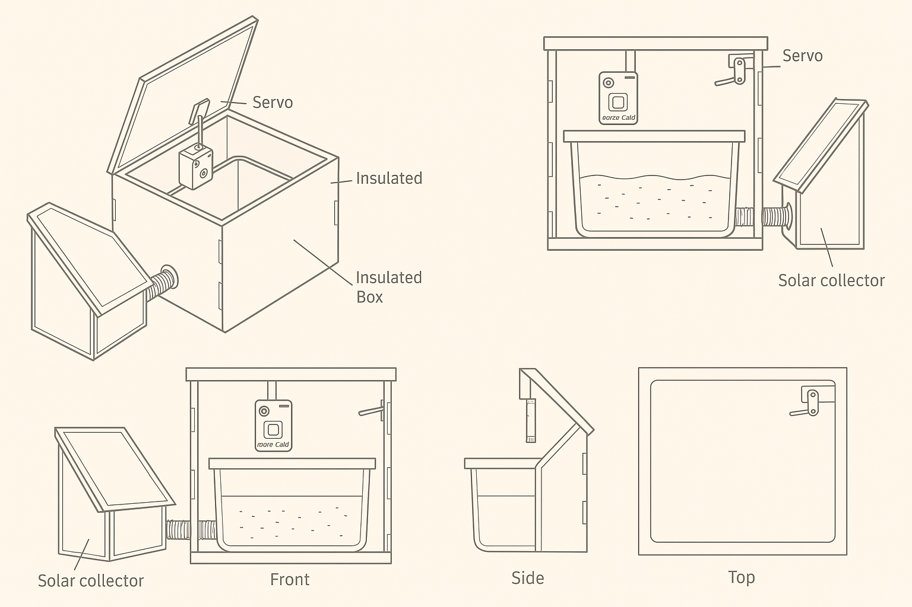

# **WiggleBin: A Solar-Enhanced Smart Worm Composting Bin**

-- Document created with ChatGPT as a starting point for the next version of WiggleBin --

## **Overview**

**WiggleBin** is an innovative, DIY, open-source worm composting bin designed to use solar energy for temperature regulation and features **smart monitoring** capabilities. It combines **solar heat collection**, **passive insulation**, and **temperature regulation** to create an optimal environment for composting worms, even during cold winter months.

In addition to maintaining the perfect environment for your worms, **WiggleBin** is integrated with smart technology, allowing you to **track the temperature**, **monitor worm activity**, and **receive data remotely**. This is achieved by integrating an **ESP-32 or ESP32-CAM**, powered by a **voltaic battery**, with a **Home Assistant** system or an **Raspberry Pi** inside your home. You can access real-time data and images of your worm bin to monitor how well your worms are doing, how fast they are eating, and more.

The **WiggleBin** is designed to be placed on your **balcony**, allowing it to take advantage of natural sunlight for heating and cooling, while also being shielded from extreme weather conditions.

This project not only supports sustainable composting practices but also integrates **low-cost, solar-powered temperature control** and **smart monitoring** to ensure worms stay in their ideal temperature range year-round.

---

## **Why WiggleBin?**

Composting worms, such as **Eisenia fetida** (red wigglers), are incredibly effective at breaking down organic waste into nutrient-rich compost. However, they are sensitive to temperature fluctuations, which can drastically affect their health and composting efficiency.

In cold climates like the **Netherlands**, the temperature in winter can drop below the worms' survival range. To protect the worms and maintain a healthy composting process, it is essential to keep the soil temperature stable and within an optimal range.

The **WiggleBin** solves this challenge by using **solar energy** for heating the compost bin in the winter and a **passive cooling system** to prevent overheating in the summer. It combines **thermal management**, **solar energy**, **passive insulation**, and **smart monitoring** to ensure worms stay comfortable, healthy, and productive, all while being energy efficient and sustainable. 

Placing the **WiggleBin** on your **balcony** optimizes the use of natural sunlight for both heating and cooling, while being sheltered from extreme weather conditions, creating the ideal environment for composting worms.

---

## **Project Research**

To design and build the **WiggleBin**, various materials and components must be considered. Below is a summary of the research into the **temperature ranges** for the compost worms, materials, and components.

### **Worm Temperature Ranges**

| **Icon** | **Worms**          | **Functional Min Temp** | **Functional Max Temp** | **Absolute Min Temp** | **Absolute Max Temp** | **Ideal Min Temp** | **Ideal Max Temp** |
|----------|--------------------|-------------------------|-------------------------|-----------------------|-----------------------|--------------------|--------------------|
| 🐛       | **Compost Worms**   | 10°C                    | 32°C                    | 5°C                   | 35°C                  | 20°C               | 29°C               |

- **Functional Min Temp**: The lowest temperature at which worms can still function but not optimally.
- **Functional Max Temp**: The highest temperature at which worms can still survive but will become less active.
- **Absolute Min Temp**: The lowest temperature worms can survive before entering dormancy or dying.
- **Absolute Max Temp**: The highest temperature worms can survive before irreversible damage occurs.
- **Ideal Min Temp**: The temperature range in which worms are most active and productive.
- **Ideal Max Temp**: The temperature at which worms thrive best.

---

### **Materials Temperature Limits**

| **Icon** | **Material**               | **Min Temp** | **Max Temp** | **Notes**                                       |
|----------|----------------------------|--------------|--------------|-------------------------------------------------|
| 🧱       | **Polypropylene (PP)**      | -20°C        | 120°C        | Good for insulation; strong and UV resistant.   |
| 🔲       | **Plexiglass**              | -40°C        | 85°C         | Transparent; used for insulation but brittle.   |
| 🔋       | **Li-ion Battery (Operating)** | 0°C         | 60°C         | The operating range to keep the battery safe.   |
| 🖨️      | **PLA (3D Printed)**        | 0°C          | 60°C         | Becomes brittle in cold; avoid above 60°C.      |
| 📦       | **Cardboard**               | 0°C          | 80°C         | Insulating material; keep dry.                  |
| 🌱       | **Black Garden Hose**       | -40°C        | 85°C         | Used for connecting the solar collector to the worm bin. |
| 🚿       | **Washing Machine Tubing**  | -40°C        | 85°C         | Flexible; used in DIY projects.                 |
| ⚙️       | **Bimetallic Strips**       | N/A          | 90°C         | Used for thermal regulation switches.           |
| 🐝       | **Wax-Based Actuators**     | 5°C          | 50°C         | For controlling heat via phase change material. |
| 🖥️       | **Raspberry Pi (Operating)**| 0°C          | 50°C         | Operates within this range; better in cool environments. |
| 📷       | **ESP32-CAM (Operating)**   | -20°C        | 85°C         | Sensitive to extreme temperatures; ensure adequate cooling. |

---

## **How It Works**

The **WiggleBin** project uses a combination of **solar heat collection**, **passive insulation**, **temperature regulation**, and **smart technology** to maintain an ideal environment for composting worms:

1. **Solar Heat Collection**: A **solar collector** is used to capture energy from the sun (even during the winter months when sunlight is limited). The solar collector is built from **laser-cut wood** with an **acrylic front plate** to maximize solar absorption. The collector **passively transfers** the captured heat up to the worm bin, warming the compost. **Black garden hose** is used to connect the solar collector to the worm bin for the transfer of the absorbed heat.

   **Temperature Limiting**: The solar collector is designed to ensure the temperature inside the worm bin never exceeds **50°C**. This is achieved through **size limitations** of the solar collector, the **color of the absorber** (avoiding overly dark colors that can absorb too much heat), and possibly incorporating **passive thermal limiters**. This ensures that the heat transferred to the bin stays within safe temperature ranges to prevent damage to materials and electronics.

2. **Insulated Box with Seasonal Panel Swap**: The worm bin is placed inside an **insulated box**, which is also **laser-cut** from **wood** for structural strength and precision. This box keeps a small space around the bin that can be filled with **wool**, **felt**, or **cardboard** to provide insulation. The box features a **black panel** for the winter months, helping absorb more heat during daylight hours. In summer, you can replace the black panel with a **white panel** to reflect sunlight and reduce excess heat. This simple yet effective method adjusts the solar energy absorption depending on the season, ensuring the worms stay within their ideal temperature range year-round.

3. **Temperature Regulation Using Servo Motors**: A **servo motor system** is incorporated to control ventilation and adjust the release of heat when necessary. When the temperature inside the bin exceeds a set limit, the motors open vents to allow hot air to escape, maintaining a stable internal temperature.

4. **Alternative Options**: As an alternative to servo motors, **wax-based actuators** or **bimetallic strips** could also be used for temperature regulation. These passive components automatically adjust ventilation based on temperature changes, without requiring a motor or electronics.

5. **Ventilation Control**: The **servo motor** system is controlled via sensors that monitor the temperature inside the bin. These motors will open or close ventilation flaps to regulate temperature, keeping it within the ideal range for the worms.

6. **Smart Monitoring with DS18B20 Temperature Sensors**: The temperature inside the worm bin is monitored using **DS18B20 temperature sensors** placed at multiple points inside the bin. This provides accurate readings to ensure that the worms are in their optimal temperature range. The temperature data is sent to a central system, allowing you to track the bin's environment remotely.

7. **Camera System with LED Ring**: An **ESP32-CAM** or similar camera is placed inside the bin to take hourly photos. The camera is equipped with a small **LED ring** for illumination, allowing it to capture clear images even in low-light conditions. These images are stored on an **SD card** and can be sent to the **cloud**, a **Raspberry Pi**, or another **ESP32** system inside the house for further processing.

8. **Timelapse Creation with Raspberry Pi**: The **Raspberry Pi** collects the hourly photos from the **ESP32-CAM** and creates a **timelapse video** once a day. This video is available via an **API**, allowing you to access and view it remotely. The timelapse provides a unique visual insight into how your worms are progressing over time, helping you monitor their activity and composting efficiency.

9. **Balcony Setup**: The **WiggleBin** is designed to be placed on your **balcony**, which allows the system to take full advantage of available sunlight while also being sheltered from harsh weather. The balcony setup also reduces space requirements, making it a perfect fit for homes with limited yard space.

---

## **Building the WiggleBin**

### **Materials Needed**

- **400x300x120 Eurobin** or any suitable bin for the worm composting.
- **Laser-cut wood** for the external box structure (can be scaled to any size).
- **Laser-cut acrylic** for the solar collector front plate.
- **Black and white panels** for the seasonal swap.
- **Black garden hose** (used to connect the solar collector to the worm bin).
- **Insulating materials** like **wool**, **felt**, or **cardboard** for the insulation around the bin.
- **Servo motors**, **wax-based actuators**, or **bimetallic strips** for temperature regulation.
- **DS18B20 temperature sensors** to monitor the worm bin's internal temperature.
- **ESP32-CAM** for taking hourly photos.
- **LED ring** to illuminate the camera.
- **Raspberry Pi** (for timelapse creation and data storage).
- **Voltaic battery** for energy storage.

### **Steps to Build**

1. **Prepare the Eurobin**: Choose a suitable **Eurobin** and place it in the center of the wooden box.
2. **Laser Cut the Box and Solar Collector**: Cut the wooden box frame and solar collector components using a laser cutter. Attach the acrylic front to the solar collector box.
3. **Install Insulation**: Add insulating materials around the bin inside the wooden box.
4. **Set Up the Solar Collector**: Connect the solar collector to the **Eurobin** using the **black garden hose** for heat transfer.
5. **Install Sensors**: Place **DS18B20 temperature sensors** inside the bin to monitor the temperature.
6. **Install Camera**: Mount the **ESP32-CAM** inside the box with an **LED ring** for illumination.
7. **Configure Smart Monitoring**: Set up the **Raspberry Pi** to process the images and create timelapse videos.
8. **Temperature Regulation**: Add **servo motors** or an alternative actuator system for ventilation control.
9. **Final Assembly**: Assemble all components and test the system for proper temperature regulation and smart functionality.

---

## **Conclusion**

The **WiggleBin** is a comprehensive DIY project that provides a sustainable and efficient way to compost organic waste using smart technology. By leveraging solar energy, passive insulation, and real-time monitoring, the **WiggleBin** ensures an optimal environment for worms year-round, while offering a unique, hands-off composting solution. The integration of **smart monitoring** and **timelapse creation** also makes it a fun and educational project for anyone interested in sustainable practices and DIY technology.
